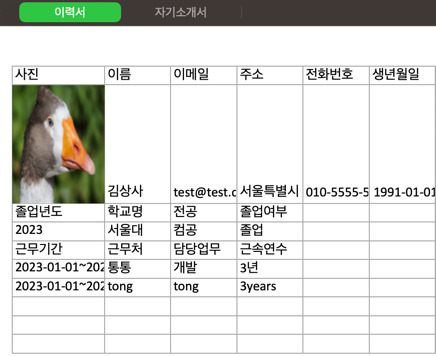

# 이력서 자동생성 프로그램

인물 정보, 교육 정보, 경력 정보를 Console을 통해 입력받고 Excel로 이력서 파일을 생성하는 프로젝트이다.

# 지원기능
이력서 자동생성 프로그램은 다음 기능을 제공합니다.

[x] 콘솔을 통해 인물, 경력, 학력정보를 입력받는다.
[x] 저장된 이미지를 읽어서 엑셀에 추가한다.
[x] 입력받은 정보를 엑셀에 저장한다.

# 사용방법

Controller/ResumController에 있는 main을 실행시킨다.

## 인물정보 입력
```
사진 파일명을 입력하세요:GOOSE.jpg
이름을 입력하세요:김상사
이메일을 입력하세요:test@test.com
주소를 입력하세요:서울특별시
전화번호를 입력하세요:010-5555-5555
생년월일을 입력하세요 (예: 1990-01-01):1991-01-01
```
사진 파일명은 프로젝트 상위에 존재하는 파일명을 입력한다.(확장자명 포함)
그리고 일므, 이메일, 주소, 전화번호, 생년월일을 입력한다.

## 학력정보 입력
```
학력 정보를 입력하세요 (종료는 q):
졸업년 학교명 전공 졸업여부
2023 한국대 컴공 졸업
졸업년 학교명 전공 졸업여부
q
```
한줄로 학력정보를 입력하고, 공백을 통해 해당 정보를 분리해서 받는다.
q를 입력하면 더 이상 입력을 받지 않고, 해당 기능을 끝낸다.

## 경력정보 입력
```
경력 정보를 입력하세요 (종료는 q):
근무기간 근무처 담당업무 근속연수
2023-01-01~2023-05-31 통통 개발 3년
경력 정보를 입력하세요 (종료는 q):
근무기간 근무처 담당업무 근속연수
2023-01-01~2023-05-31 tong tong 3years
경력 정보를 입력하세요 (종료는 q):
근무기간 근무처 담당업무 근속연수
q
```
한줄로 경력정보를 입력하고, 공백을 통해 정보를 분리해서 받는다.
q를 입력하면 더 이상 입력을 받지 않고, 해당 기능을 끝낸다.

## 자기소개서 입력
```
자기소개서를 입력하세요. 여러 줄을 입력하려면 빈 줄을 입력하세요.
치킨먹고싶다.
잘할게요...
화이잍ㅇ!!

```
여러줄로 자기소개 정보를 입력할 수 있다.
공란을 기입하면 더 이상 입력을 받지 않고, 해당기능을 끝낸다.

## 자기소개서 파일 출력


최종적으로 프로젝트 root 디렉토리에 `이력서.xlsx`파일을 생성한다.

